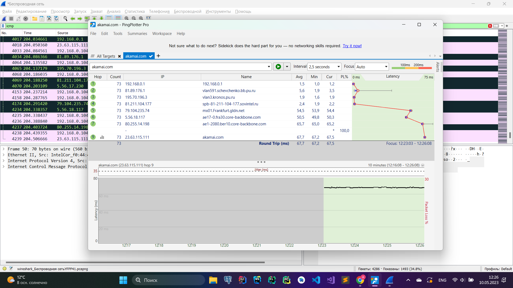
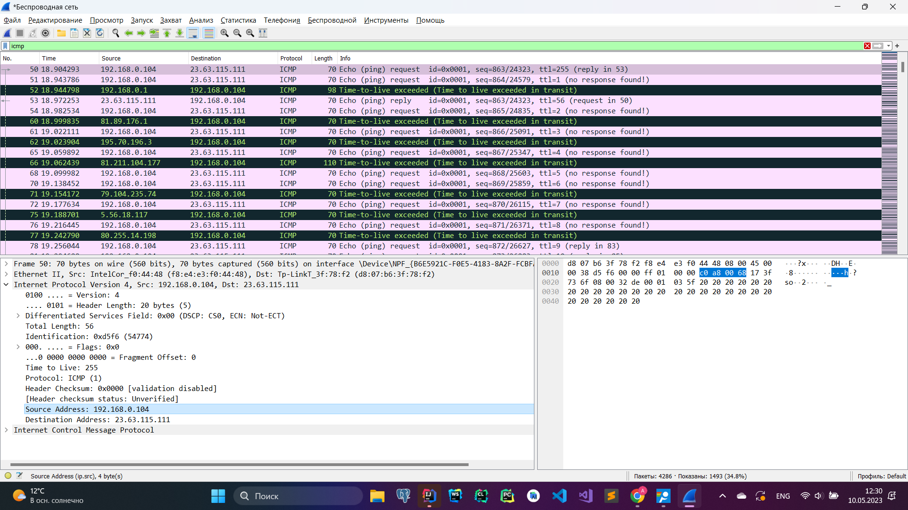
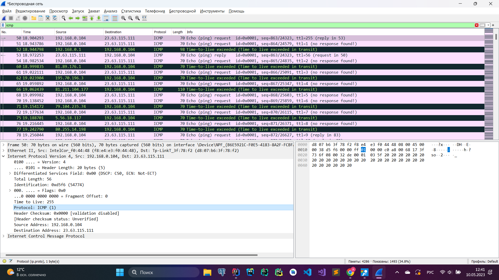
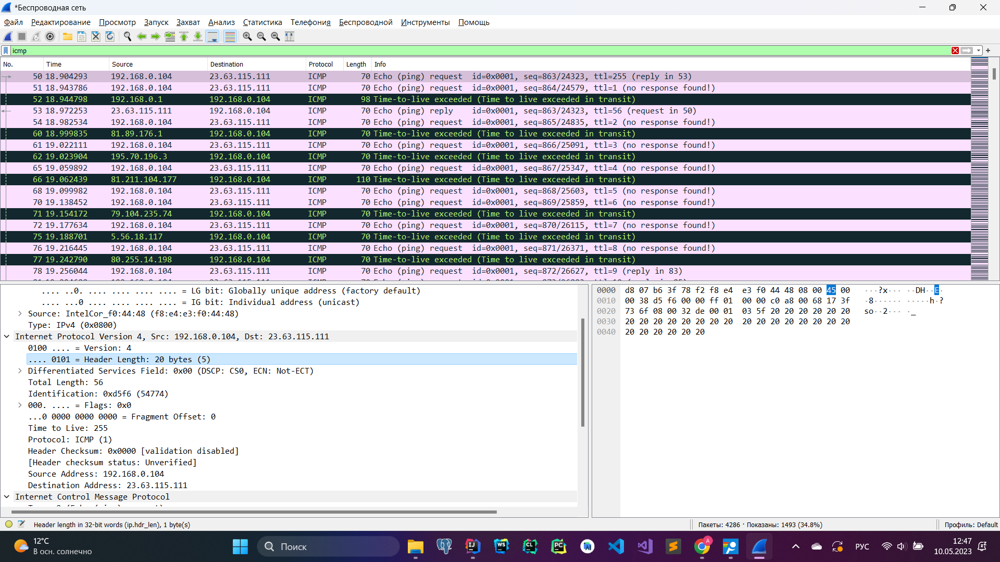
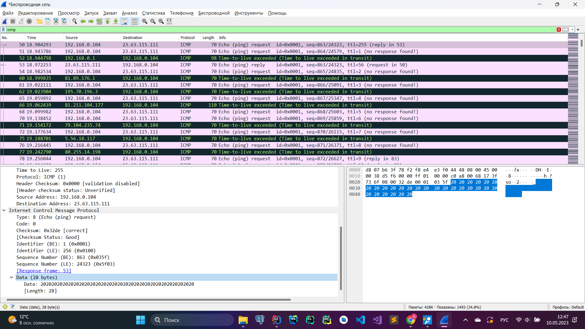
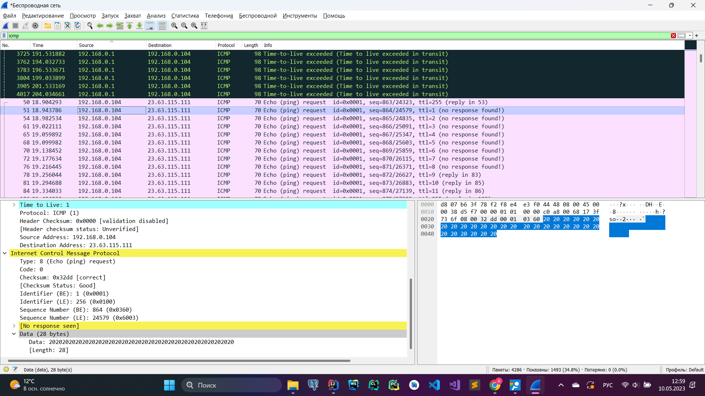
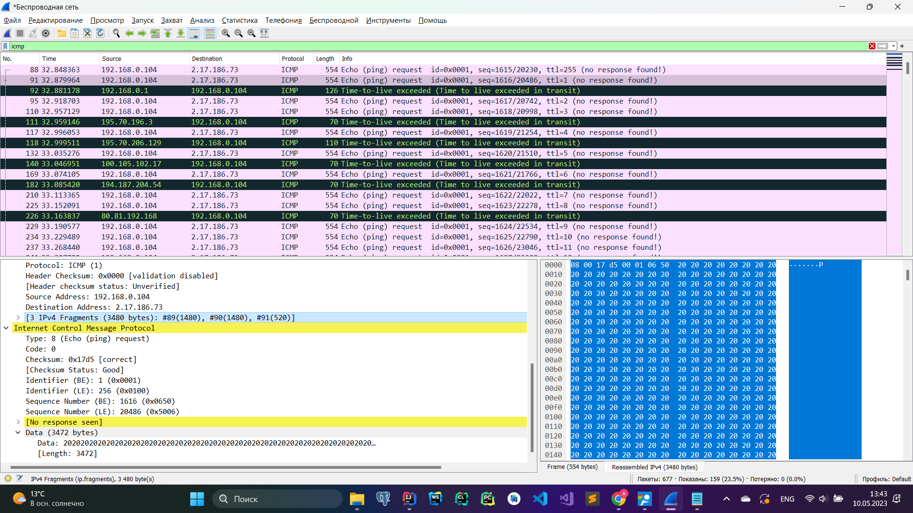

### 1. Wireshark. IP
 
1. *Выберите первое ICMP-сообщение эхо-запроса, отправленное вашим компьютером, и
раскройте часть информации о пакете Internet Protocol в окне подробной информации.
Каков IP-адрес вашего компьютера?*
    
    IP-адрес моего компьютера - 192.168.0.104.
2. *Найдите заголовок IP-пакета. Какое значение указано здесь в поле протокола верхнего
уровня?*
    
    ICMP (1)
3. *Сколько байт в IP-заголовке? Сколько байт приходится на полезную нагрузку IPдейтаграммы?
    
    На IP-заголовок приходится 20 байт. 
    
    На полезную нагрузку (ICMP пакет) приходится 36 байт. Из них 8 байт - ICMP-заголовок, и 28 байт - полезные данные.
4. *Отсортируйте отслеженные пакеты по их исходному IP-адресу; для этого щелкните по
заголовку столбца Source. Выберите первое сообщение эхо-запроса, отосланное
вашим компьютером по протоколу ICMP, и раскройте раздел Internet Protocol.*  
    
    * *Какие поля IP-дейтаграммы всегда изменяются от одной дейтаграммы к
    следующей в рамках одной последовательности ICMP-сообщений, отсылаемых
    компьютером (последовательность – это все сообщения, которые
    отправляются до конечного хоста)?*  
    Меняются: TTL и Identification.
    * *Какие поля не меняются? Какие поля должны оставаться неизменными? Какие
    поля должны изменяться? (в рамках одного запуска утилиты)*  
    Не меняются: Version, Header Length, Differentiated Services Field, Total Length, Protocol, Header Checksum, Source Address, Destination Address. </li>
    * *Как изменяется значение поля Identification IP-дейтаграммы с каждым
    последующим эхо-запросом? Есть ли какая-либо закономерность?*  
    Увеличивается на 1.
5. *Какое значение содержится в поле Identification (Идентификация), а какое – в поле TTL
(выберите какой-либо один пакет ICMP)?*  
    Identification: 0xd5f7 (54775)  
    Time to Live: 1
6. *Остаются ли эти значения (Identification и TTL) неизменными во всех сообщениях
протокола ICMP, где содержится информация об истечении предписанного времени
жизни; рассмотрите только те из таких сообщений, которые поступили на компьютер с
ближайшего (первого транзитного) маршрутизатора.*  
    TTL - да, Identification - нет
7. *Найдите серии откликов ICMP, в которых содержатся сообщения об истечении
предписанного времени жизни (time-to-live exceeded). Выберите один из пакетов.
Какое значение содержится в поле Identification (Идентификация), а какое – в поле
TTL?*  
    Identification: 0x1dc4 (7620)  
    Time to Live: 64
8. *Фрагментация. Остановите захват пакетов в Wireshark. Измените размер пакета
Packet Size = 3500 байт. Снова запустите захват пакетов в Wireshark и перезапустите
трассировку. (Для Unix заново запустите traceroute с длиной пакета 3500 байт).
Найдите первое сообщение протокола ICMP с эхо-запросом, поступившее на ваш
компьютер (с уже измененным размером пакета).*
    * *Было ли это сообщение фрагментировано между двумя или более IPдейтаграммами? Если да, то сколько фрагментов было создано?*
    
    Да, оно было разбито на 3 фрагмента: 1480, 1480, 520 байт соответственно.
    * *Какие поля IP-заголовка изменяются в разных фрагментах?*  
    Flags, Fragment Offset, Total Length
