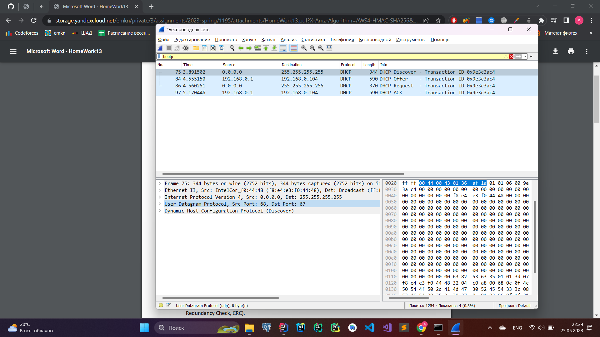
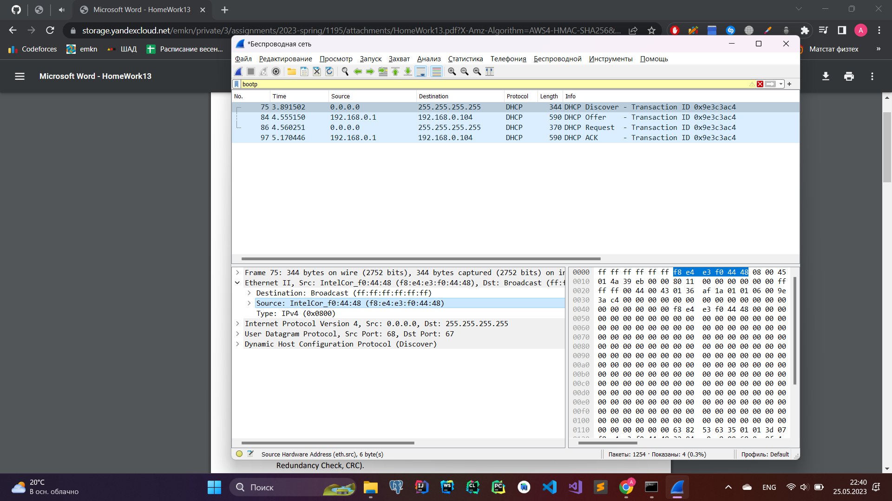
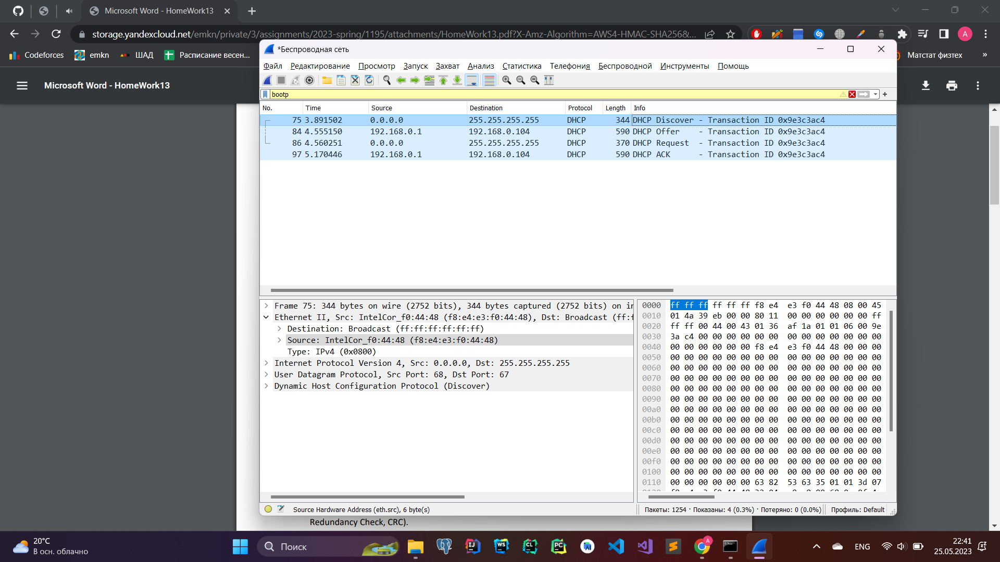
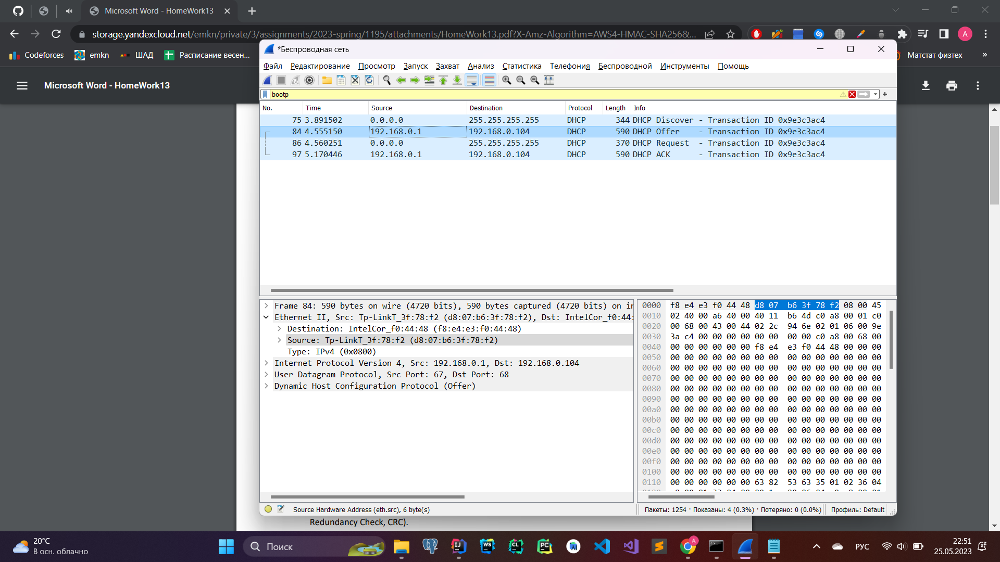
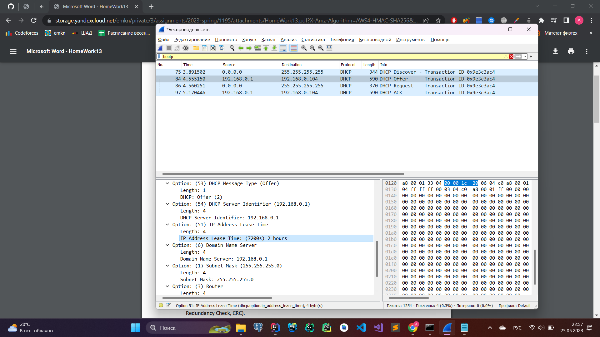

# Wireshark
## Wireshark: DHCP
1. *Поверх какого протокола посылаются сообщения DHCP – UDP или TCP?*
    
    UDP
2. *Каков адрес канального уровня (т.е., Ethernet-адрес) у вашего хоста?*
    
    f8:e4:e3:f0:44:48
3. *Каковы значения Transaction-ID в наборе (Request/ACK) DHCP-сообщений? Опишите
    назначение поля Transaction-ID.*
    
    Значения Transaction-ID в наборе (Request/ACK) DHCP-сообщений одинаковы (Transaction ID 0x9e3c3ac4). Идентификатор Transaction-ID позволяет матчить запрос на получение адреса с ответом на него.
4. *Хост использует DHCP-протокол, в частности, для получения IP-адреса. Но IP-адрес хоста
    остается неподтвержденным до завершения обмена DHCP сообщениями. Если IP-адрес не
    установлен до завершения обмена сообщениями, то какие значения используются в IPдейтаграммах при обмене этими сообщениями? Укажите исходный и конечный IP-адреса,
    передаваемые в инкапсулирующей IP-дейтаграмме DHCP сообщений*
    Source: 0.0.0.0; Destination: 255.255.255.255; (широковещательная рассылка)
5. *Каков IP-адрес вашего DHCP-сервера?*
    
    IP-адрес DHCP-сервера: 192.168.0.1.
6. *Объясните назначение срока аренды IP-адреса. Какова длительность срока аренды в
    вашем эксперименте?*
    
    Срок аренды IP-адреса определяет срок, по истечении которого DHCP-сервер будет считать этот адрес свободным, после чего нам прийдется запросить новый адрес.  
    IP Address Lease Time: (7200s) 2 hours
