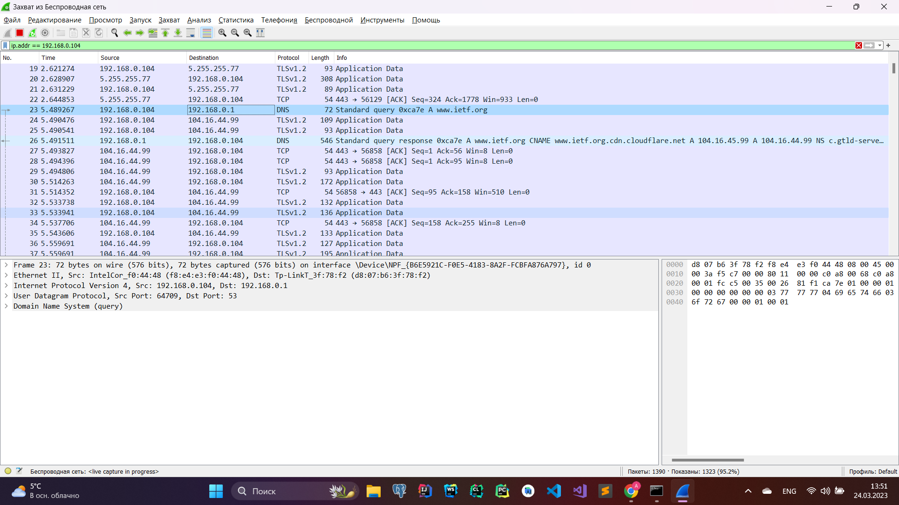
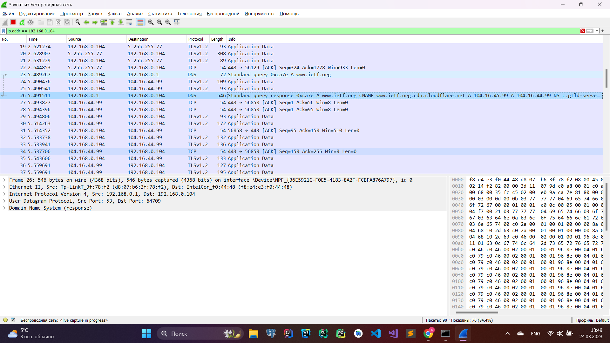
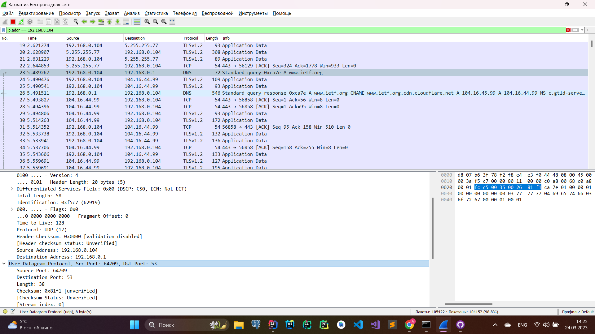
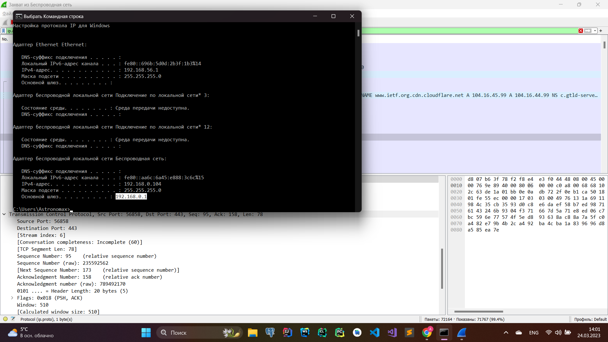
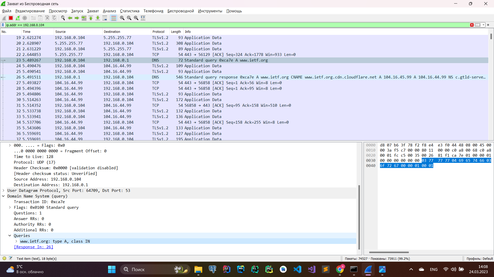
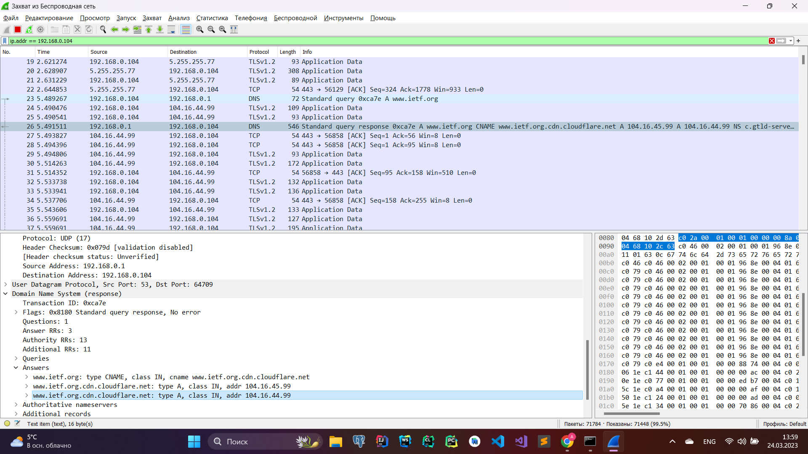
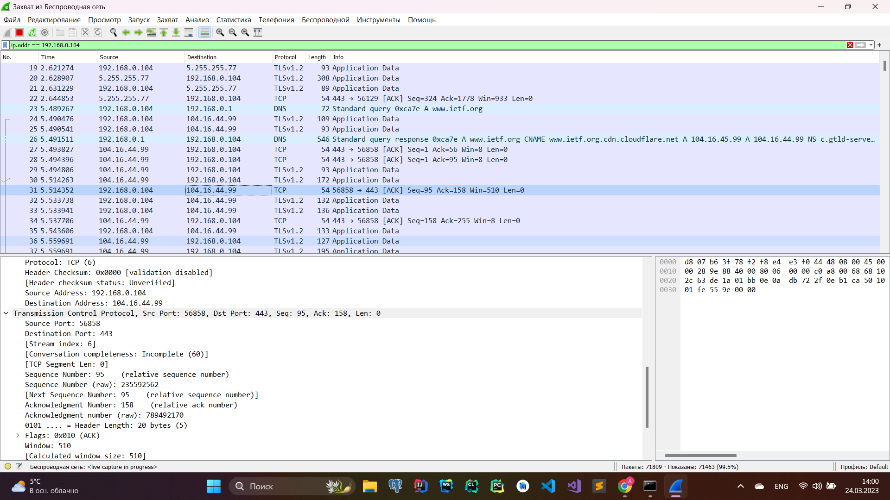

#### Б. DNS-трассировка www.ietf.org
* *Найдите DNS-запрос и ответ на него. С использованием какого транспортного протокола
  они отправлены?*
  
  
  Запрос и ответ отправлены с использованием протокола DNS.
* *Какой порт назначения у запроса DNS?*
  
  Порт назначения: 53 
* *На какой IP-адрес отправлен DNS-запрос? Используйте ipconfig для определения IP-адреса
  вашего локального DNS-сервера. Одинаковы ли эти два адреса?*  
  Запрос отправлен на 192.168.0.1
  
* *Проанализируйте сообщение-запрос DNS. Запись какого типа запрашивается? Содержатся
  ли в запросе какие-нибудь «ответы»?*
  
  Запрашивается запись типа A. В запросе 0 ответов.  
* *Проанализируйте ответное сообщение DNS. Сколько в нем «ответов»? Что содержится в
  каждом?*
  
  В ответном сообщении 3 ответа.
* *Посмотрите на последующий TCP-пакет с флагом SYN, отправленный вашим компьютером.
  Соответствует ли IP-адрес назначения пакета с SYN одному из адресов, приведенных в
  ответном сообщении DNS?*
    
  Да, соответствует.
* *Веб-страница содержит изображения. Выполняет ли хост новые запросы DNS перед
  загрузкой этих изображений?*  
  Нет, не выполняет.
