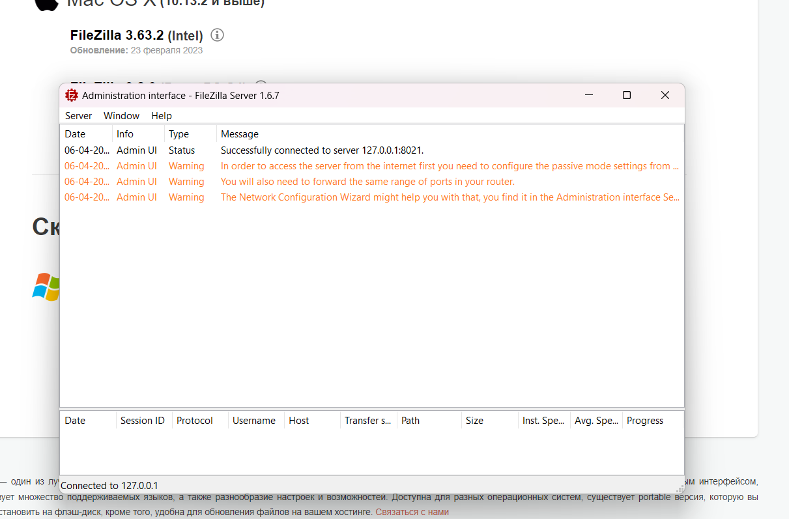
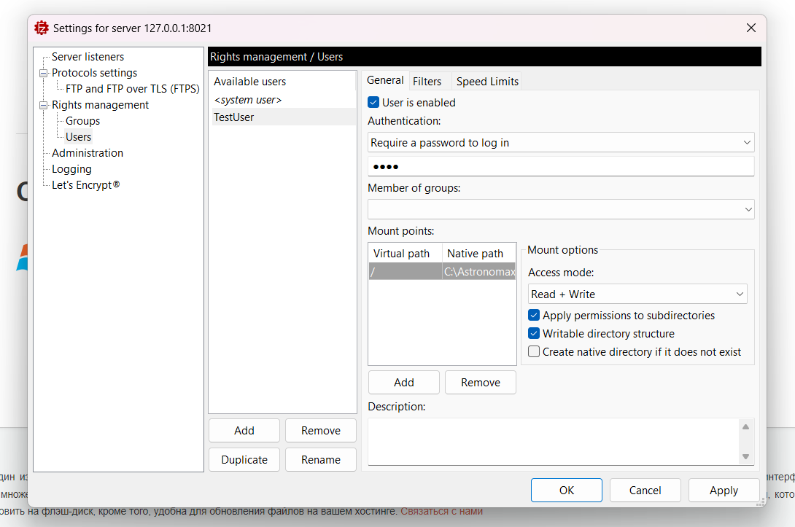
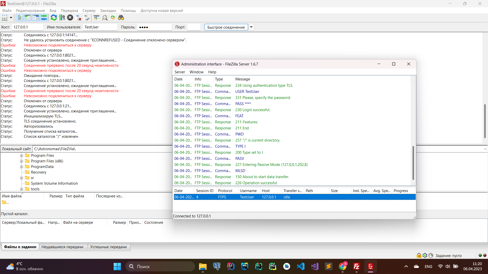
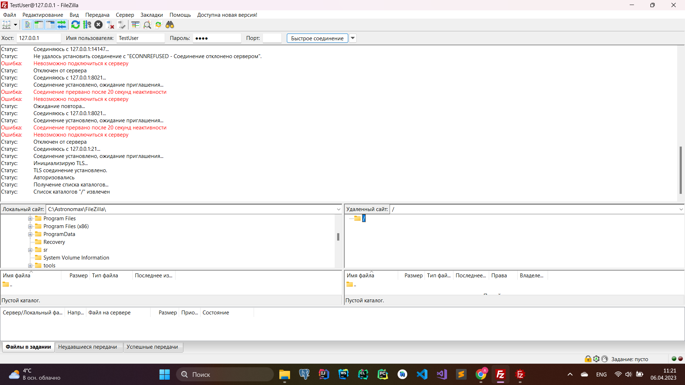
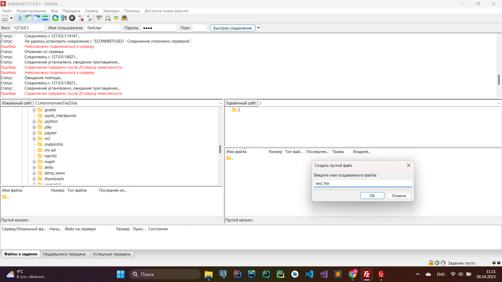
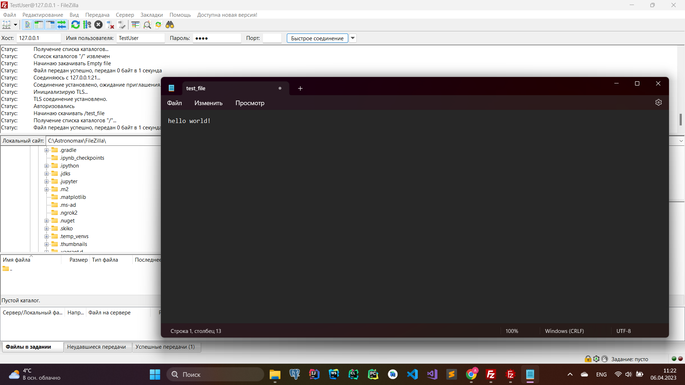
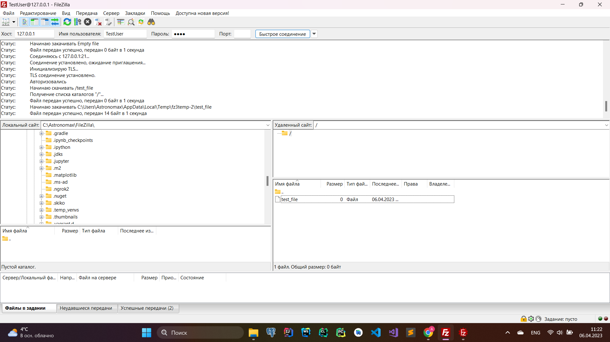
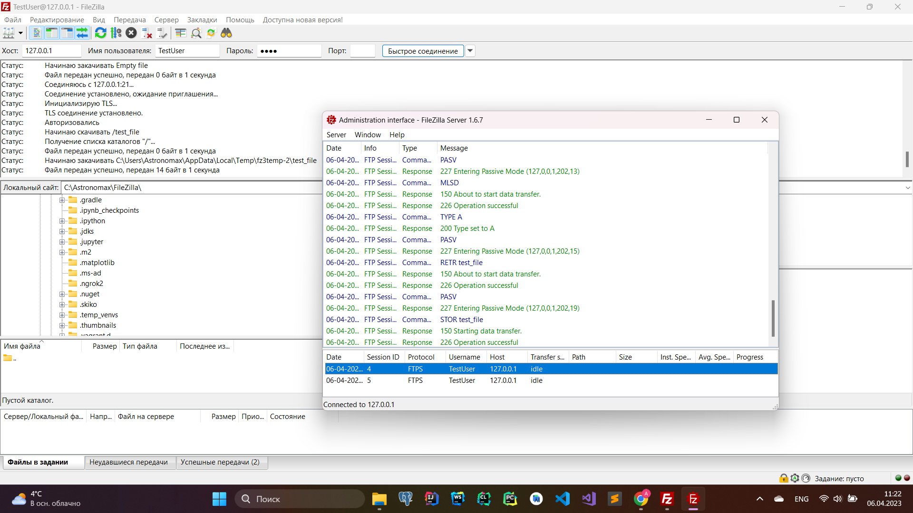
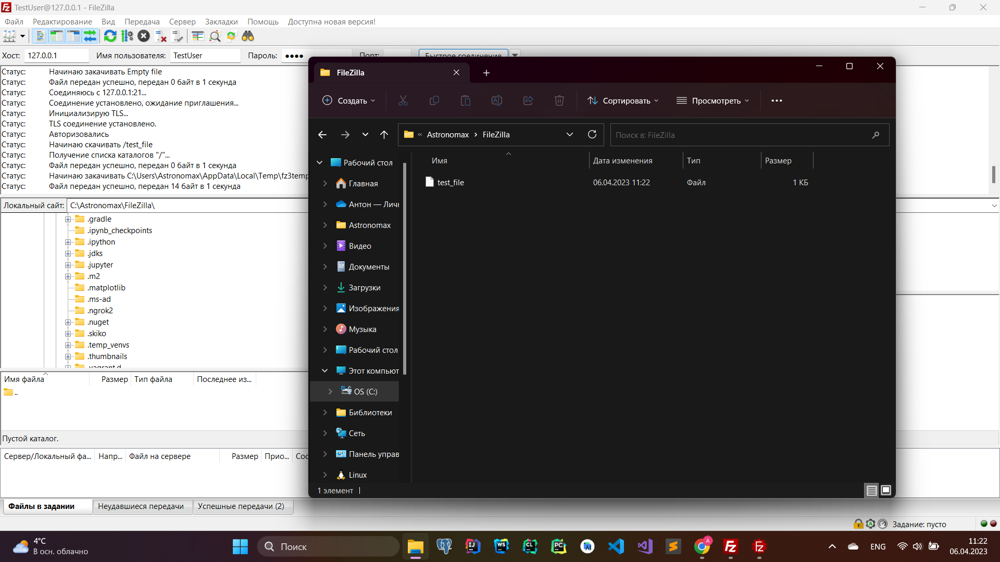

#### 1. FileZilla сервер и клиент

Запустил FTP-сервер на 21 порту при помощи FileZilla Server.

Добавил пользователя TestUser с паролем 1234, с доступом к каталогу "C:/Astronomax/FileZilla"

Через FileZilla Client подключился к этому серверу.

Добавил через клиент файл "test_file" в удаленный каталог.

Открыл файл на редактирование и внёс следующее содержимое: 

В интерфейсе юзера видим сообщения, что всё прошло успешно.

Так же в приложении администратора сервера видим сообщения об успешных операциях клиента.

Убеждаемся, что теперь в каталоге действительно присутствует переданный по FTP файл. 

  