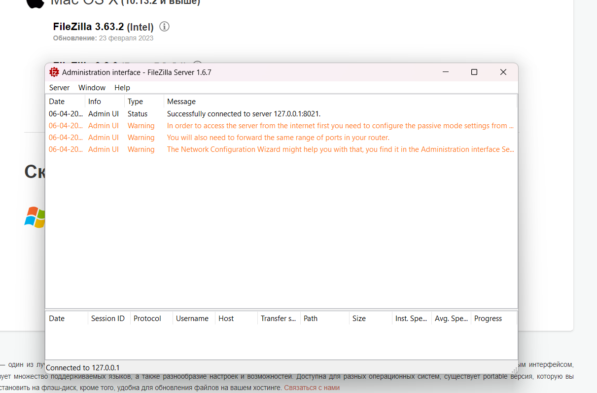
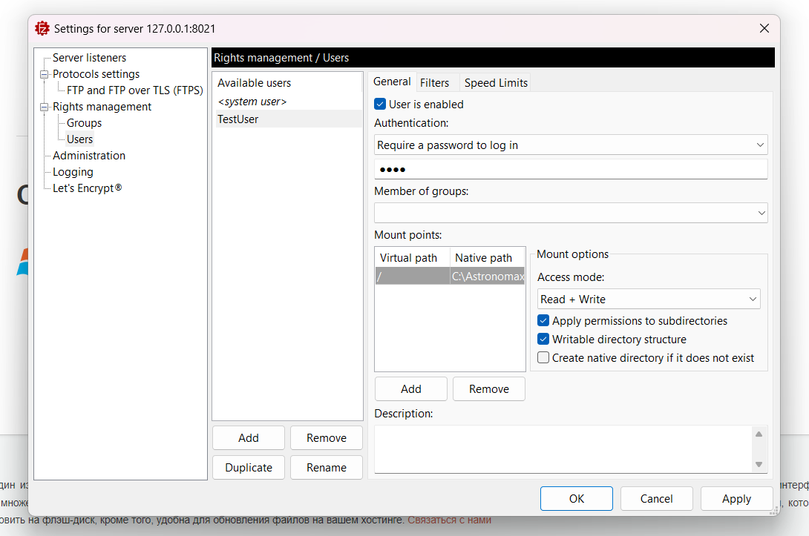
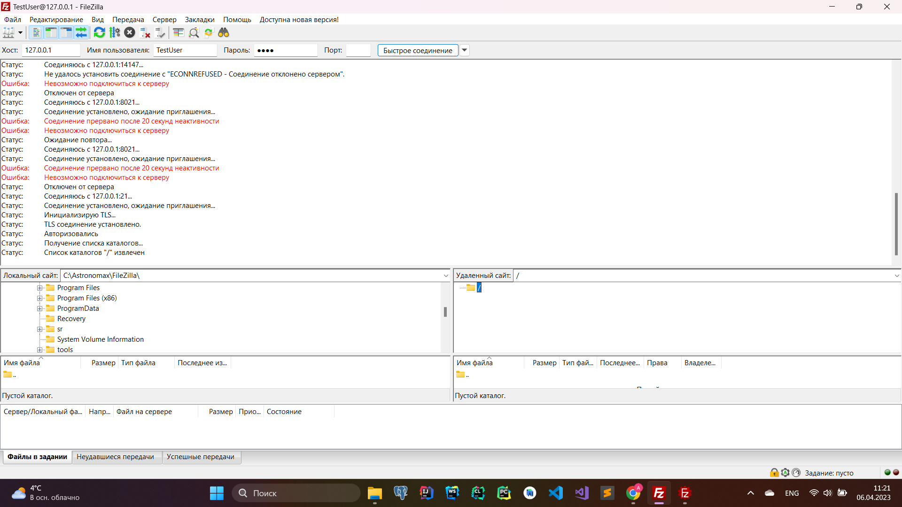
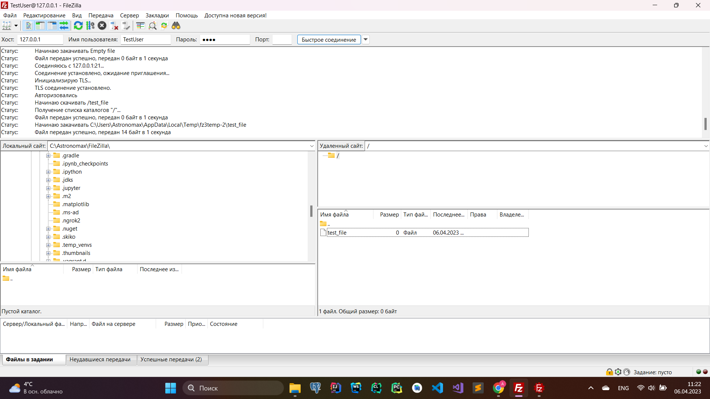
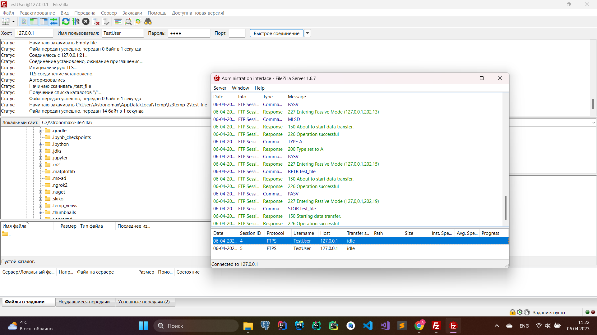
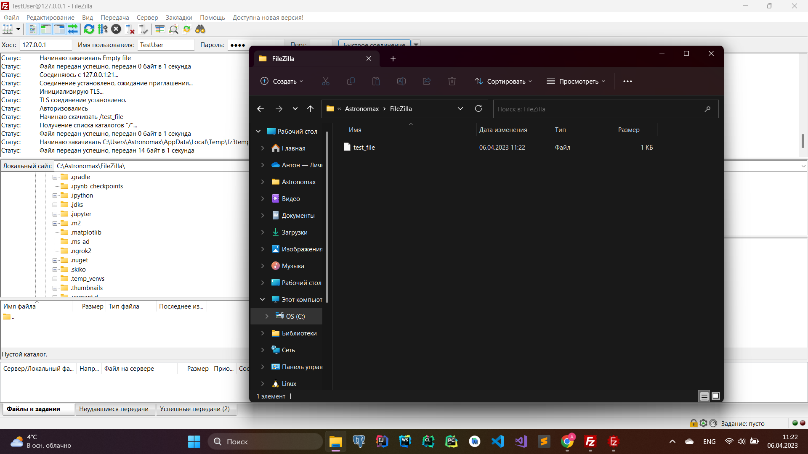

### 1. Wireshark: UDP

Сделал DNS-запрос.
```console
C:\Users\Astronomax>nslookup www.spbu.ru
╤хЁтхЁ:  UnKnown
Address:  192.168.0.1

╚ь :     spbu.ru
Address:  81.89.183.222
Aliases:  www.spbu.ru
```

Заголовок "Source Port" занимает 2 байта.

"Destination Port" - 2 байта.

"Length" - 2 байта.

"Checksum" - 2 байта.

"UDP payload" - 42 байта.  
Общая сумма сходится с тем, что написано в "Length" (размер UDP дейтаграммы) - 50 байт.  
Максимальный размер полезной нагрузки - 508 байт.  
Максимально возможное значение номера порта отправителя - 65535.

Номер UDP протокола: 17 (11 в шестнадцатеричной системе).  
Номера портов в запросе:  
```
Source Port: 50356
Destination Port: 53
```
Номера портов в ответе:  
```
Source Port: 53
Destination Port: 50356
```
### 2. Программирование. FTP
#### 1. FileZilla сервер и клиент

Запустил FTP-сервер на 21 порту при помощи FileZilla Server.

Добавил пользователя TestUser с паролем 1234, с доступом к каталогу "C:/Astronomax/FileZilla"

Через FileZilla Client подключился к этому серверу.


Добавил через клиент файл "test_file" в удаленный каталог.

Открыл файл на редактирование и внёс следующее содержимое: 

В интерфейсе юзера видим сообщения, что всё прошло успешно.

Так же в приложении администратора сервера видим сообщения об успешных операциях клиента.

Убеждаемся, что теперь в каталоге действительно присутствует переданный по FTP файл. 

  