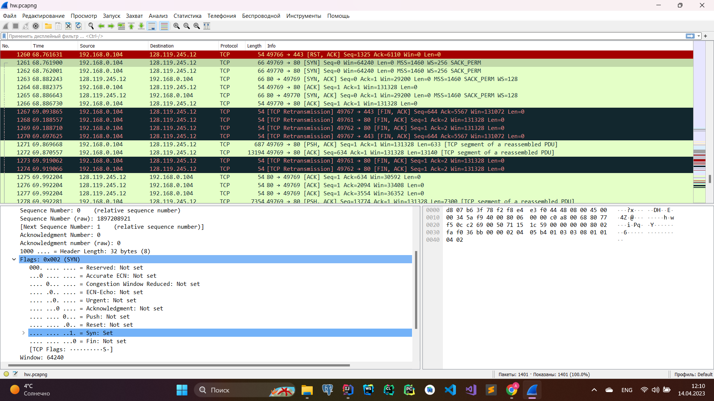
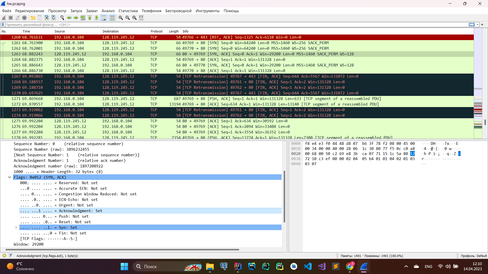
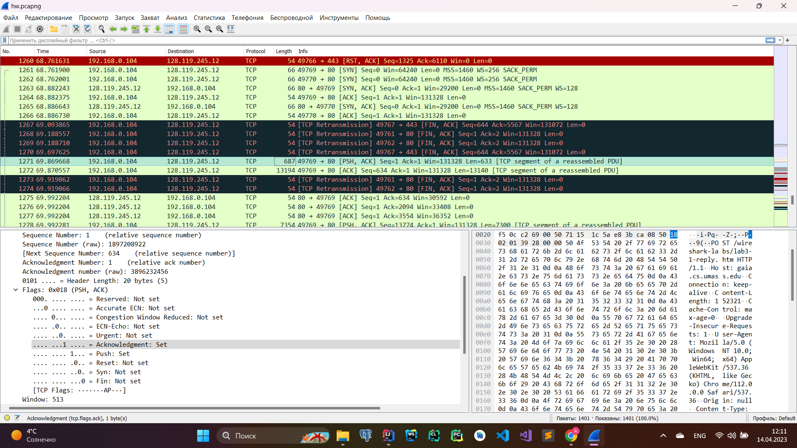
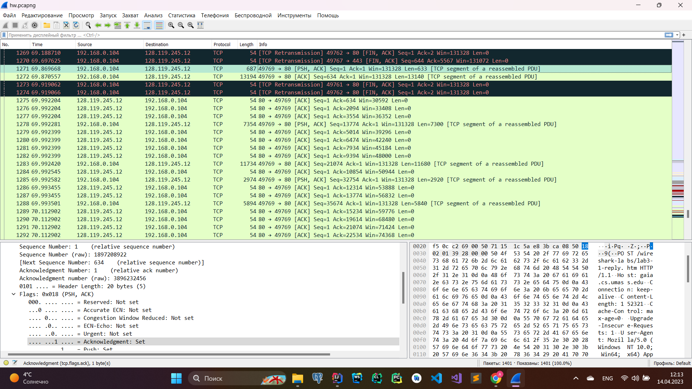
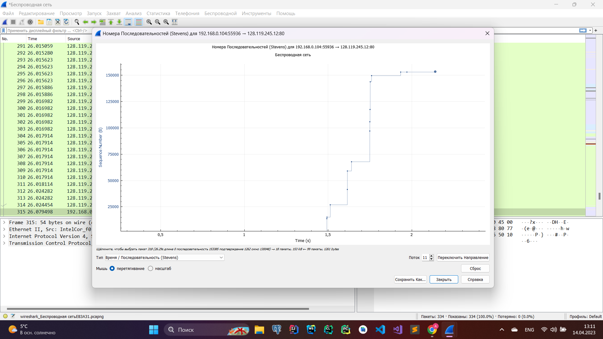

### 1. Wireshark: TCP
1. Мой компьютер использует IP-адрес 192.168.0.104, порт 49769.

2. Сервер использует IP-адрес 128.119.245.12, порт 80.

3. SYN TCP-сегмента для установления соединения имеет порядковый номер 0. 
Понять, что это SYN сегмент можно по флагам внутри пакета.
4. SYNACK-сегмента имеет порядковый номер 0, в поле подтверждения значение 1. 
Cервер определяет значение номера подтверждения, увеличивая порядковый номер SYN-сегмента на 1. 
Понять, что это SYNACK сегмент можно по флагам внутри пакета.
5. TCP-сегмент, содержащий команду POST имеет порядковый номер 1.

6.
- sequentialNumber = 1, sendTime = 69.8696, acknowledgeTime = 69.9922, RTT = 0.1226
- sequentialNumber = 634, sendTime = 69.8705, acknowledgeTime = 69.9934, RTT = 0.1229
- sequentialNumber = 13774, sendTime = 69.9922, acknowledgeTime = 70.1129, RTT = 0.1207
- sequentialNumber = 21074, sendTime = 69.9924, acknowledgeTime = 70.1144, RTT = 0.1220
- sequentialNumber = 32754, sendTime = 69.9925, acknowledgeTime = 70.1144, RTT = 0.1219
- sequentialNumber = 35674, sendTime = 69.9935, acknowledgeTime = 70.1152, RTT = 0.1217

7. d = L / t, где d - пропускная способность, L - объем переданных данных, t - время передачи (время между первым пакетом данных и последним ACK пакетом).  
L = 148.57 Кбайт (размер файла alice.txt)  
t = 70.3569 - 69.8696 = 0.4873  
d = 148.57 / 0.4873 = 304.88 Кбайт/c
### 2. Wireshark: Работа с Time-Sequence-Graph (Stevens)
