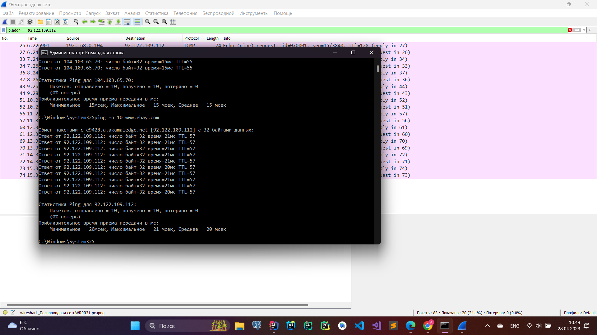
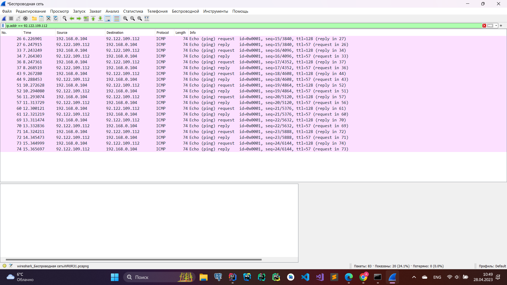
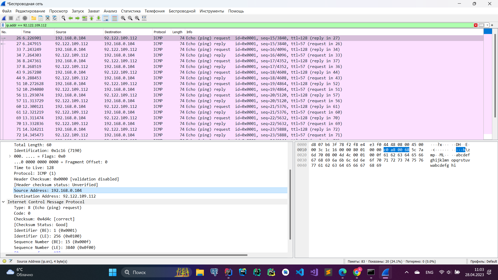
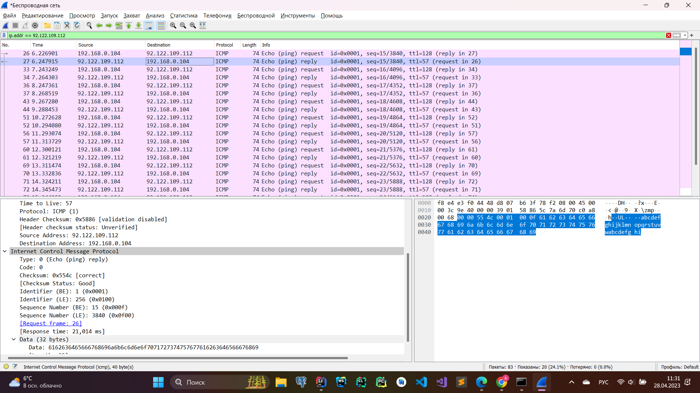

### 1. Ping
* *Каков IP-адрес вашего хоста? Каков IP-адрес хоста назначения?*
     
     
    IP-адрес моего хоста - 192.168.0.107. IP-адрес хоста назначения - 216.58.210.174
* *Почему ICMP-пакет не обладает номерами исходного и конечного портов?*  
         
    Номера портов являются особенностью протоколов транспортного уровня, таких как TCP и UDP. ICMP на самом деле является частью межсетевого уровня (IP), поэтому этот атрибут не существует на этом уровне.
* *Рассмотрите один из ping-запросов, отправленных вашим хостом. Каковы ICMP-тип и кодовый
    номер этого пакета? Какие еще поля есть в этом ICMP-пакете? Сколько байт приходится на поля
    контрольной суммы, порядкового номера и идентификатора?*  
    Type: 0 (Echo (ping) reply), Code: 0. Поля контрольной суммы, порядкового номера и идентификатора занимают по 2 байта каждое.
* *Рассмотрите соответствующий ping-пакет, полученный в ответ на предыдущий. Каковы ICMP тип и кодовый номер этого пакета? Какие еще поля есть в этом ICMP-пакете? Сколько байт
    приходится на поля контрольной суммы, порядкового номера и идентификатора?*  
    
    Type: 0 (Echo (ping) reply), Code: 0. Поля контрольной суммы, порядкового номера и идентификатора так же, как и в запросе, занимают по 2 байта каждое. Sequence number и identifier не изменились, что подтверждает то, что это действительно ответ на предыдущий запрос.
### 2. Traceroute