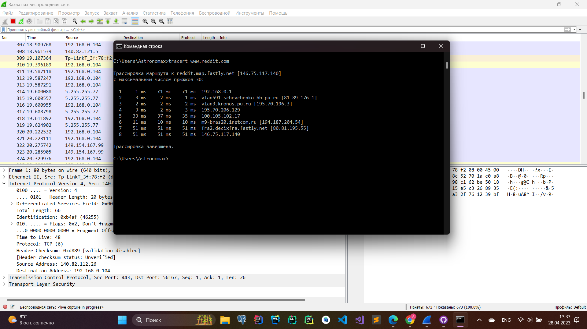
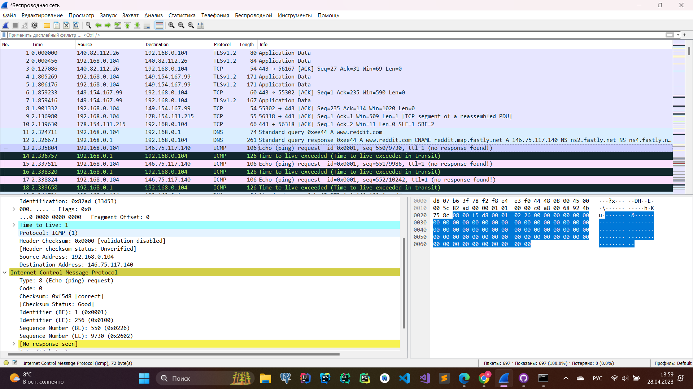
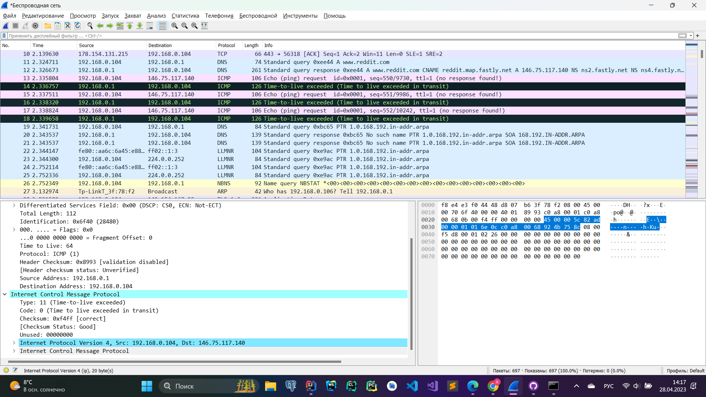
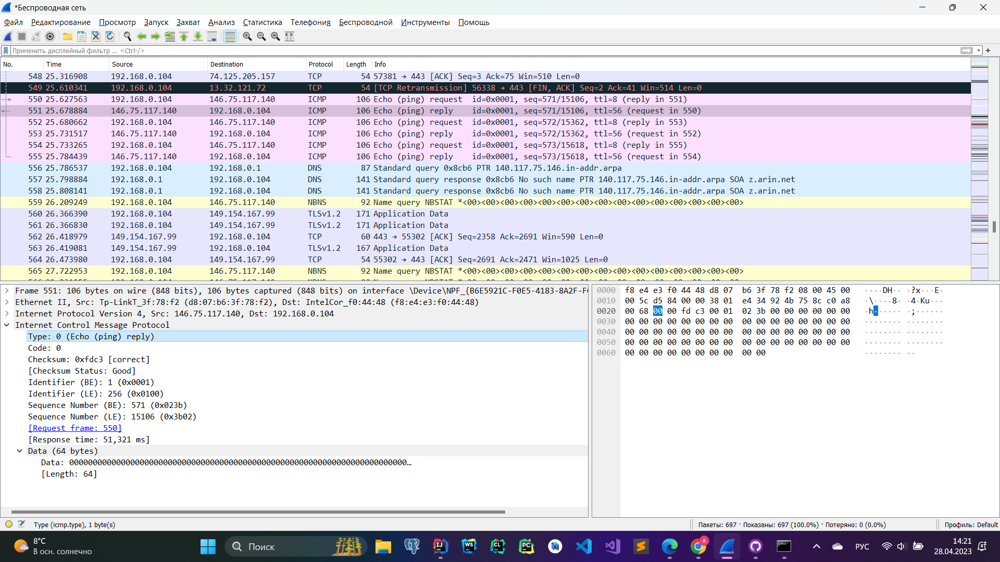

### 1. Ping
* *Каков IP-адрес вашего хоста? Каков IP-адрес хоста назначения?*
     
     
    IP-адрес моего хоста - 192.168.0.107. IP-адрес хоста назначения - 216.58.210.174
* *Почему ICMP-пакет не обладает номерами исходного и конечного портов?*  
         
    Номера портов являются особенностью протоколов транспортного уровня, таких как TCP и UDP. ICMP на самом деле является частью межсетевого уровня (IP), поэтому этот атрибут не существует на этом уровне.
* *Рассмотрите один из ping-запросов, отправленных вашим хостом. Каковы ICMP-тип и кодовый
    номер этого пакета? Какие еще поля есть в этом ICMP-пакете? Сколько байт приходится на поля
    контрольной суммы, порядкового номера и идентификатора?*  
    Type: 0 (Echo (ping) reply), Code: 0. Поля контрольной суммы, порядкового номера и идентификатора занимают по 2 байта каждое.
* *Рассмотрите соответствующий ping-пакет, полученный в ответ на предыдущий. Каковы ICMP тип и кодовый номер этого пакета? Какие еще поля есть в этом ICMP-пакете? Сколько байт
    приходится на поля контрольной суммы, порядкового номера и идентификатора?*  
    
    Type: 0 (Echo (ping) reply), Code: 0. Поля контрольной суммы, порядкового номера и идентификатора так же, как и в запросе, занимают по 2 байта каждое. Sequence number и identifier не изменились, что подтверждает то, что это действительно ответ на предыдущий запрос.
### 2. Traceroute

```console
C:\Users\Astronomax>tracert www.reddit.com

Трассировка маршрута к reddit.map.fastly.net [146.75.117.140]
с максимальным числом прыжков 30:

  1     1 ms    <1 мс    <1 мс  192.168.0.1
  2     3 ms     2 ms     1 ms  vlan591.schevchenko.bb.pu.ru [81.89.176.1]
  3     2 ms     2 ms     2 ms  vlan3.kronos.pu.ru [195.70.196.3]
  4     3 ms     2 ms     3 ms  195.70.206.129
  5    33 ms    37 ms    35 ms  100.105.102.17
  6    11 ms    10 ms    10 ms  m9-bras20.inetcom.ru [194.187.204.54]
  7    51 ms    51 ms    51 ms  fra2.decixfra.fastly.net [80.81.195.55]
  8    51 ms    51 ms    51 ms  146.75.117.140

Трассировка завершена.
```
* *Рассмотрите ICMP-пакет с эхо-запросом на вашем скриншоте. Отличается ли он от ICMP-пакетов
с ping-запросами из Задания 1 (Ping)? Если да – то как?*  

Пакет практически не отличается от тех, что были в предыдущем задании, за исключением того, что TTL теперь равен 1, а не 128.
* *Рассмотрите на вашем скриншоте ICMP-пакет с сообщением об ошибке. В нем больше полей,
чем в ICMP-пакете с эхо-запросом. Какая информация содержится в этих дополнительных полях?*  

Теперь поля Type и Code выглядят так: Type: 11 (Time-to-live exceeded), Code: 0 (Time to live exceeded in transit). Помимо этого, ответное сообщение так же содержит в себе заголовок нашего ICMP запроса.
* *Рассмотрите три последних ICMP-пакета, полученных исходным хостом. Чем эти пакеты
отличаются от ICMP-пакетов, сообщающих об ошибках? Чем объясняются такие отличия?*  

В этот раз заданного TTL хватило, чтобы достить целевого хоста, поэтому ответное сообщение теперь имеет тип Type: 0 (Echo (ping) reply).
* *Есть ли такой канал, задержка в котором существенно превышает среднее значение? Можете
ли вы, опираясь на имена маршрутизаторов, определить местоположение двух маршрутизаторов,
расположенных на обоих концах этого канала?*  
m9-bras20.inetcom.ru [194.187.204.54] -> fra2.decixfra.fastly.net [80.81.195.55] (51 ms)  
При этом сложно сказать, что-то про местоположение маршрутизаторов, пользуясь только именами.